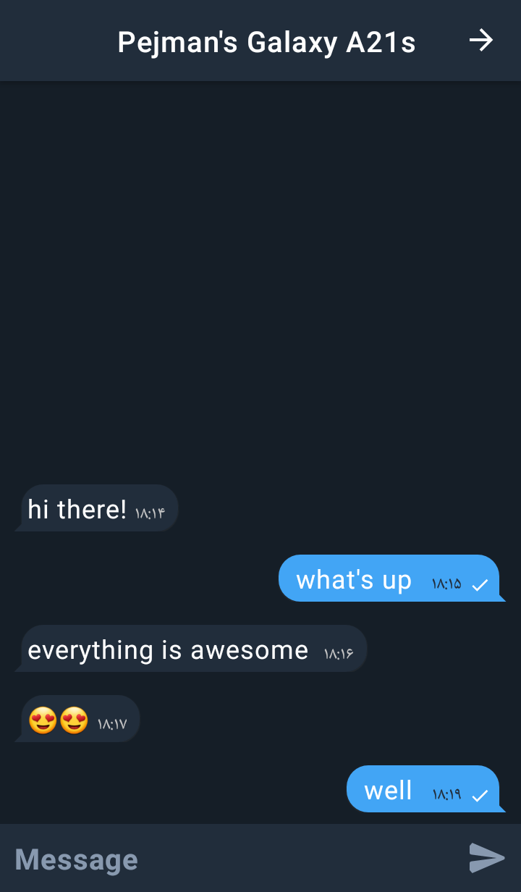
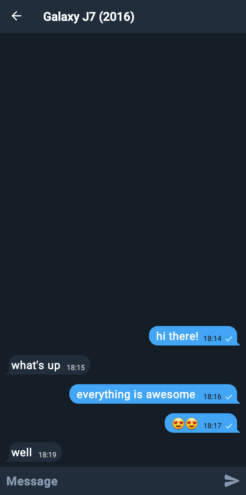
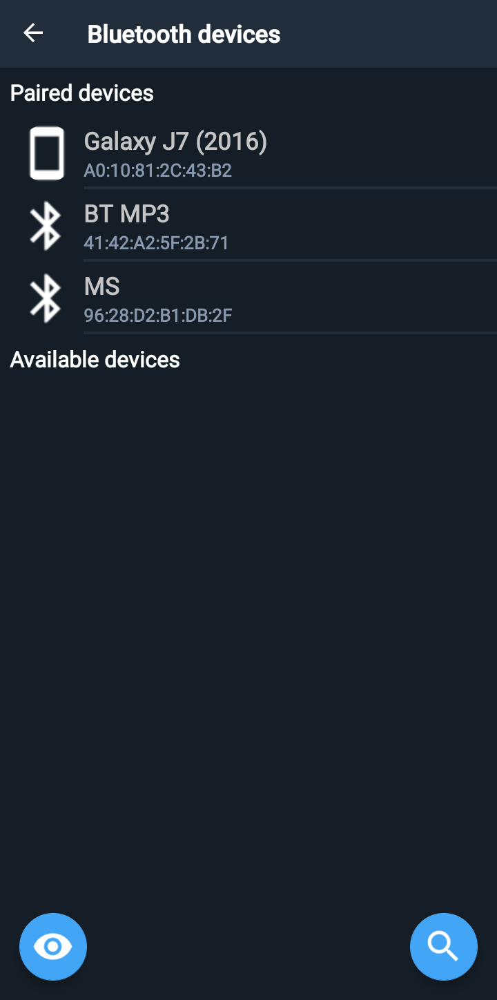
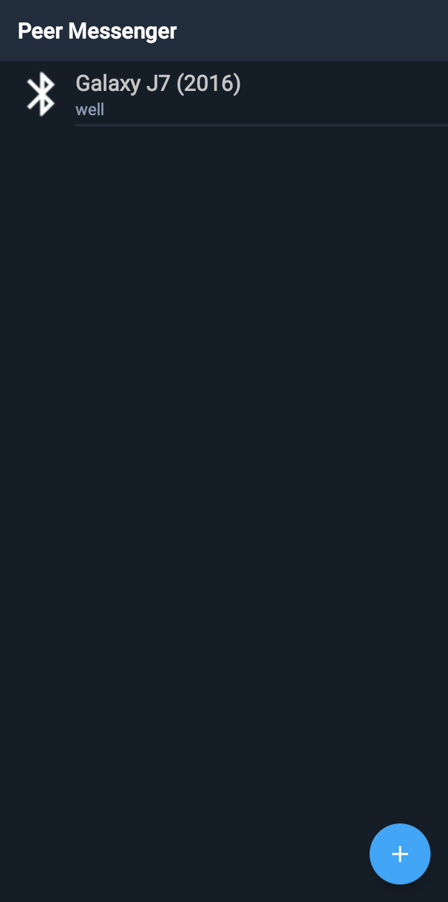
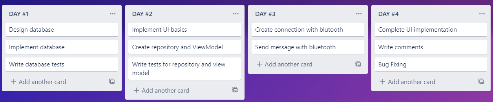

# In name of Allah

## 1.First of all, We need to choose an architectural design.

Because the MVVM architecture was suggested by Google and also because most of the documentation is written for this architecture, I chose it. However, I think the MVI architecture is also suitable for this project.

## 2.Design database

A relational database is suitable for this challenge and the best relational database for Android is "Room".
And I usually chose that. some reasons:

* In this challenge we have two entities, device and message. And the relationship between these two expansions is one to many. And easily implemented by "Room"

* With "flow" you can easily see the changes inside the database, and this is a great advantage provided by the room and coroutine.

* Room also supports transactions and this is awesome for real-time apps.

## 3.Design Ui
  * used Material Design, which is my favorite design language. And I have usually used its components.

  * Lottie library to show the clock below undelivered messages  note: I feel this app UI is not very well It could have been better if I had spent more time :(

## 4.Testing
  * I wrote several unit tests and integration tests for this challenge. Because this program has no complicated logic, its existence is not felt much. But I used it to show my abilities

## 5.Working with Bluetooth
* I thought this part would not take much time, but a small mistake caused me to waste hours of time, but I finally overcame it. I used Google's example for this part and I think this is a best practice. Although I think it needs to be rewritten like corountine.

## 6.Stabilize & make chat reliable:
* When the user is offline, he can also send his message and messages will be sent as soon as he is connected to that user.

* **To make sure the message is received by the user:**
For this feature, I used the acknowledgment technique in such a way that when the message is successfully received, a feedback message is sent to the sender and this action is also stored in the sender's database because the connection may be lost when sending feedback. The next connection sends a feedback message.

## 7.Chat list and history:
As written in the database design section, there are several messages per user, and with a simple relationship, all users and their messages can be displayed on the home-fragment by the 'flow' (to receive last updates).

## App Screenshots

  

## Tasks Screenshot
  

### **Thanks for your attention.**